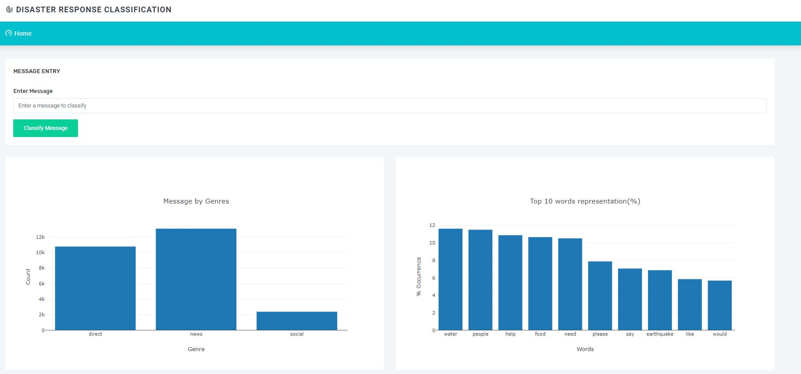
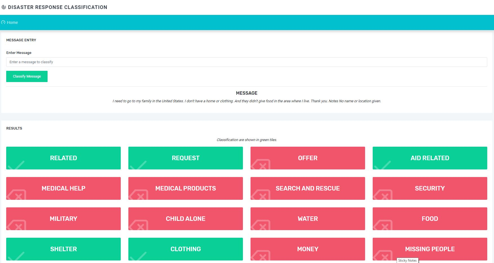
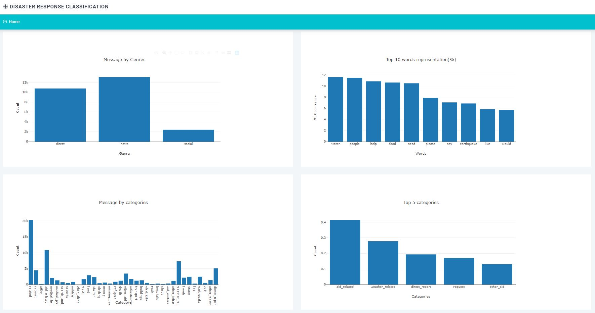

# Data Scientist Nanodegree

## Project: Disaster Response Pipeline

## Table of Contents

- [Project Overview](#overview)
- [Project Components](#components)
  - [ETL Pipeline](#etl_pipeline)
  - [ML Pipeline](#ml_pipeline)
  - [Flask Web App](#flask)
- [Running](#run)
  - [Data Cleaning](#cleaning)
  - [Training Classifier](#training)
  - [Starting the Web App](#starting)
- [Conclusion](#conclusion)
- [Files](#files)
- [Software Requirements](#sw)
- [Credits and Acknowledgements](#credits)

***

<a id='overview'></a>

## 1. Project Overview
This project uses two datasets from from <a href="https://www.figure-eight.com/" target="_blank"> Figure Eight</a> for processing and classification of distress mesages from three different channels. Processing is done via NLP and Machine learning pipelines. Also a web application is build with the optimized classifier to classify messages to the response category the message is belongs in order to increase response time of the responding organizations.

The web app included is to enable an emergency worker input a message and get classification results in several categories. The web app will also display visualizations of the data as stored in sqlite database.

[Here](#eg) are a few screenshots of the web app.

**_Screenshot 1_**



What the app will do is that it will classify the text message into categories so that appropriate relief agency can be reached out for help.

**_Screenshot 2_**




<a id='components'></a>

## 2. Project Components

There are three components of this project:

<a id='etl_pipeline'></a>

### 2.1. ETL Pipeline

File _data/process_data.py_ contains data cleaning operations that:

- Loads the `messages` and `categories` dataset from the csv file.
- Merges the two datasets
- Cleans the data
- Stores it in a **SQLite database**

<a id='ml_pipeline'></a>

### 2.2. ML Pipeline

File _models/train_classifier.py_ contains machine learning process that:

- Loads data from the **SQLite database**
- Splits the data into training and testing sets
- Builds a text processing and machine learning pipeline
- Trains and tunes a model using GridSearchCV
- Outputs result on the test set
- Exports the final model as a pickle file

<a id='flask'></a>

### 2.3. Flask Web App

<a id='eg'></a>

Running [this command](#com) **from app directory** will start the web app where users can enter their query, i.e., a request message sent during a natural disaster, e.g. _"Please, we need tents and water. We are in Silo, Thank you!"_.


<a id='run'></a>
## 3. Running

There are three steps to get up and runnning with the web app if you want to start from ETL process.

<a id='cleaning'></a>

### 3.1. Data Cleaning

**Go to the project directory** and the run the following command:

```bat
python data/process_data.py data/disaster_messages.csv data/disaster_categories.csv data/DisasterResponse.db
```

This will perform cleaning operations on the data and save the result in sqlite database.

_DisasterResponse.db_ already exists in _data_ folder but the above command will still run and replace the file with same information. 


<a id='training'></a>

### 3.2. Training Classifier

After the data cleaning process, run this command **from the project directory**:

```bat
python models/train_classifier.py data/DisasterResponse.db models/classifier.pkl
```

This will use cleaned data to train the model, improve the model with grid search and saved the model to a pickle file (_classifer.pkl_).

_classifier.pkl_ already exists but the above command will still run and replace the file will same information.


<a id='starting'></a>

### 3.3. Starting the web app

After performing the above processes, you can now run the web app to see the visualizations.

**Go the app directory** and run the following command:

<a id='com'></a>

```bat
python run.py
```

This will start the web app and will direct you to a URL where you can enter messages and get classification results for it.
**NOTE:** Running on your local machine requires you to use http://localhost:3001

**_Screenshot 6_**


<a id='conclusion'></a>

## 4. Conclusion

Some information about training data set as seen on the main page of the web app.

**_Screenshot 7_**



As we can see the data is highly imbalanced. Though the accuracy metric is [high](#acc) (you will see the exact value after the model is trained by grid search, it is ~0.94), it has a poor value for recall (~0.6). So, take appropriate measures when using this model for decision-making process at a larger scale or in a production environment.

<a id='files'></a>

## 5. Files

<pre>
.
├── app
│   ├── run.py------------------------# FLASK FILE THAT RUNS APP
│   ├── static------------------------# STATIC FILES FOR THE WEB APP
│   └── templates
│       ├── go.html-------------------# CLASSIFICATION RESULT PAGE OF WEB APP
│       └── master.html---------------# MAIN PAGE OF WEB APP
├── data
│   ├── DisasterResponse.db-----------# DATABASE TO SAVE CLEANED DATA TO
│   ├── disaster_categories.csv-------# DATA TO PROCESS
│   ├── disaster_messages.csv---------# DATA TO PROCESS
│   └── process_data.py---------------# PERFORMS ETL PROCESS
├── screenshots-----------------------# IMAGES USES IN README FROM THE WEB APP
├── models
│   └── train_classifier.py-----------# PERFORMS CLASSIFICATION TASK
│   └── classifier.pkl----------------# ML TRAINING RESULT 

</pre>

<a id='sw'></a>

## 6. Software Requirements

This project uses **Python 3.6.6**

<a id='credits'></a>

## 7. Credits and Acknowledgements

Thanks <a href="https://www.udacity.com" target="_blank">Udacity</a> for letting me use their logo as favicon for this web app.


### Instructions:
1. Run the following commands in the project's root directory to set up your database and model.

    - To run ETL pipeline that cleans data and stores in database
        `python data/process_data.py data/disaster_messages.csv data/disaster_categories.csv data/DisasterResponse.db`
    - To run ML pipeline that trains classifier and saves
        `python models/train_classifier.py data/DisasterResponse.db models/classifier.pkl`

2. Run the following command in the app's directory to run your web app.
    `python run.py`

3. Go to http://0.0.0.0:3001/
